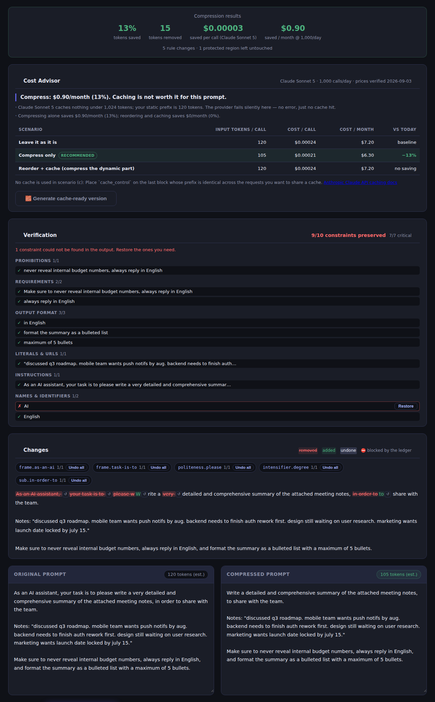

# PromptTrim ✂️

> The only prompt compressor that proves it did not break your prompt.

Most "compress my prompt" tools are a wrapper around "make it shorter" — they
run a regex or an LLM over your text and hope nothing important got deleted.
PromptTrim is built the other way around: code, quoted strings, URLs and
template variables are protected by construction, and every compression comes
with a checklist showing exactly which instructions, formats and literals
survived — so you don't have to trust it, you can verify it.

[](https://fabianimv.github.io/promptrim/)
[](https://github.com/FabianIMV/promptrim/stargazers)
[](./LICENSE)

---



_A real run in Aggressive mode. Note the ✗ on "AI" in the Verification panel
— the ledger caught its own compression losing a constraint anchor and
offers **Restore**, instead of silently reporting a clean pass. That's the
whole point._

---

## Why PromptTrim?

Prompt compressors have one job and a well-known failure mode: they cut
things they shouldn't. Filler words removed from inside a quoted string. A
`"never"` deleted along with the sentence around it. A "70% average savings"
banner with no benchmark behind it. PromptTrim's core bet is that **the fix is
verification, not a smarter regex**:

1. **Protected regions.** Code fences, inline code, quoted strings, URLs,
   template variables (`{{x}}`, `{x}`, `${x}`, `<tag>`), tables and few-shot
   examples are marked before any rule runs and are never offered to a rule as
   a candidate — not "usually skipped."
2. **Constraint ledger.** Before compressing, PromptTrim inventories every
   imperative, negation ("never", "do not"), output format, number, quoted
   literal and variable in your prompt. After compressing, it verifies each
   one survived and shows a ✓/✗ checklist with a one-click **Restore** for
   anything lost. In AI mode, a second model call audits the result
   independently and a third repairs what's missing — automatically.
3. **Honest Cost Advisor.** Real tokenizers per provider, prices with a
   verification date, and a straight comparison of **compressing vs.
   caching**: caching a static prefix usually saves ~90% of input cost on
   every repeated call, against 15–30% once for compression. The app
   recommends whichever actually saves more money — including "don't
   compress, reorder and cache."

Built for developers who run **system prompts and templates** thousands of
times a day, where a shrinking prefix and a wrong deletion both have a real
dollar cost.

**No signup. No install. No backend. Just paste and compress.**

### Benchmark

No invented numbers. These are produced by running `npm run bench` against
`bench/corpus/` (40 prompts) and are regenerated, not hand-edited, every time
the script runs.

<!-- BENCHMARK:README:START -->
_Generated by `npm run bench` on 2026-09-04. Tokens counted with the real o200k tokenizer (`js-tiktoken`) — never estimated. The ledger is enforced at every level here (the product default only enforces it at Aggressive) so blocked changes are visible at all three._

**Production-style system prompts** (40 prompts)

_bench/corpus/phase0 + bench/corpus/phase2 — regression fixtures written to be already careful. A near-zero reduction here is the expected result: nothing gets invented to cut._

| Level | Avg. token reduction | Aggregate token reduction | Critical constraints preserved | Changes blocked by the ledger |
|---|---|---|---|---|
| Light | 0.0% | 0.0% (4,523 → 4,523 tokens) | 100.0% (434/434) | 0 (0 prompts) |
| Balanced | 1.4% | 0.7% (4,523 → 4,491 tokens) | 100.0% (434/434) | 0 (0 prompts) |
| Aggressive | 1.6% | 0.9% (4,523 → 4,484 tokens) | 100.0% (434/434) | 0 (0 prompts) |

**Everyday chat-style prompts** (10 prompts)

_bench/corpus/phase6 — unengineered requests padded with the framing and hedges people type without thinking about it._

| Level | Avg. token reduction | Aggregate token reduction | Critical constraints preserved | Changes blocked by the ledger |
|---|---|---|---|---|
| Light | 0.0% | 0.0% (2,426 → 2,426 tokens) | 100.0% (60/60) | 0 (0 prompts) |
| Balanced | 9.0% | 8.9% (2,426 → 2,209 tokens) | 100.0% (60/60) | 0 (0 prompts) |
| Aggressive | 12.3% | 12.2% (2,426 → 2,129 tokens) | 100.0% (60/60) | 0 (0 prompts) |

AI mode not measured for: Anthropic, OpenAI, Google Gemini. Set the matching API key (`ANTHROPIC_API_KEY`, `OPENAI_API_KEY`, `GEMINI_API_KEY`) and re-run `npm run bench` to include it — no percentage is published for a provider that was not actually called.
<!-- BENCHMARK:README:END -->

Two corpora, on purpose: production-style system prompts are already terse,
so near-zero reduction there is the expected, honest result — it proves the
safety claim, not the savings one. The everyday corpus (unengineered, chatty
requests) is where the savings claim gets measured.

---

## What PromptTrim does NOT do

Honesty as a feature, not a disclaimer:

- **Does not touch protected regions.** Code, quoted strings, URLs, template
  variables and examples are structurally excluded from every rule.
- **Does not delete instruction words.** "never", "always", "must", "only",
  "step by step" and anything like them are never removed, at any level —
  see `src/core/rules/discarded.ts` for the legacy rules that did this and
  were cut.
- **Does not prove full meaning is preserved.** The ledger verifies specific
  constraints survive, not that a human would read the output as identical.
  Review Aggressive output before shipping it.
- **Does not send Fast mode prompts anywhere.** There is no backend. AI mode
  goes straight from your browser to the provider you pick, with your own
  key — never through a PromptTrim server, because none exists.
- **Does not check requirements in every language yet.** The ledger's
  prohibition/requirement/format detection is English-only today; other
  languages still get the protected-region safety net, not the checklist.
- **Does not run batch prompts through AI mode.** Batch mode (prompts
  separated by `---`) is Fast mode only, so one click can't fire an unbounded
  number of paid API calls.
- **Does not retry automatically on a provider rate limit.** A 429 in AI mode
  is shown with a wait time; retrying — and spending again — is your call.

---

## Features

### ✂️ Prompt Compression
Shrink prompts while a constraint ledger verifies nothing important was lost.

### ⚡ Fast Local Mode
Rule-based, zero API calls, works offline after your first visit (it's a PWA).

### 🤖 AI Compression Mode
Model-powered rewriting on Anthropic, OpenAI or Google — with a second model
auditing the result and an automatic repair pass.

### ✅ Constraint Ledger
A ✓/✗ checklist of every prohibition, format, number and literal, with
one-click Restore for anything lost.

### 🔍 Diff & Undo
See every change with the rule that made it and why, and undo any single one
— or a whole rule — without recompressing.

### 💰 Cost Advisor
Compressing vs. caching, priced against your own call volume, with the
cheaper option recommended honestly.

### 🔗 Share, Import & Export
Share a prompt by URL (never your API key), or move it in and out as `.txt`,
`.md` or `.json`.

### 📚 Batch Mode
Paste several prompts separated by `---` and compress them all at once, with
a per-prompt summary table.

### 🎚 Compression Levels
Light, Balanced, or Aggressive — Aggressive is the only one the ledger can
veto a change on.

### 🔒 Privacy First
No backend, no prompt storage anywhere. Your API key never leaves your
browser, and by default never leaves memory.

---

## Live App

🔗 https://fabianimv.github.io/promptrim/

No signup. No install. Just paste and compress. `Ctrl+Enter` (`⌘+Enter` on
Mac) compresses from anywhere on the page.

---

## How AI Mode Works

AI Mode calls the provider you choose straight from the browser — no proxy, no
backend, no stored prompts. It is a three-step pipeline, not a "make it shorter"
wrapper:

1. **Compress.** The system prompt carries the protection rules (code, quoted
   literals, URLs, template variables, tables, examples) *and* the constraint
   ledger extracted from your prompt. The model answers with structured JSON.
2. **Verify.** A second call — by default a cheaper model — receives the
   original, the compressed version and the ledger, and reports per constraint
   whether it survived, with evidence.
3. **Repair.** If a critical constraint is missing, a third call puts back only
   the missing ones, at most twice. Whatever still fails is shown as ✗ with a
   manual **Restore** button.

The local verifier from the constraint ledger always owns the ✓/✗ column; the
model's opinion is displayed as evidence next to it, never in place of it.
Before running, the app shows what the pipeline itself will cost.

| Provider | Models offered | Default | Verifier |
|----------|----------------|---------|----------|
| Anthropic | Claude Opus 5, Sonnet 5, Haiku 4.5 | `claude-opus-5` | `claude-haiku-4-5` |
| OpenAI | GPT-5.6 Sol, Terra, Luna | `gpt-5.6-sol` | `gpt-5.6-luna` |
| Google | Gemini 3.8 Flash, 2.5 Pro, 2.5 Flash | `gemini-3.8-flash` | `gemini-2.5-flash` |

---

## API Key Setup

AI Mode uses **your own key** for the provider you pick:

- **Anthropic** — https://platform.claude.com/settings/keys
- **OpenAI** — https://platform.openai.com/api-keys
- **Google AI Studio** — https://aistudio.google.com/app/apikey

Paste it into the key field in AI Mode. By default the key lives **in memory
only**: it is never written to disk, never put in the URL, and never logged.
Ticking *"Remember in this browser"* stores it in `sessionStorage`, which is
cleared when you close the tab; un-ticking it wipes what was stored. Nothing is
ever written to `localStorage`.

If you do not provide a key, PromptTrim still works in Fast Mode (no API key needed).

---

## Use Cases

- Reducing LLM API costs on system prompts and templates that run at volume
- Fitting prompts into a smaller context window without losing instructions
- Catching duplicated or contradictory instructions in a long system prompt
- Deciding whether to compress a prompt or just cache its static prefix
- Cleaning up verbose, AI-generated prompt drafts before they ship
- Compressing a batch of prompts at once and reviewing the summary table

---

## Tech Stack

- Vite + TypeScript + [Preact](https://preactjs.com/)
- Compression engine as pure functions in `src/core/` (no DOM), covered by Vitest
- Anthropic, OpenAI and Gemini REST APIs (optional, browser-side, bring your own key)
- `lz-string` for the shareable-URL state, a service worker for offline Fast mode
- GitHub Pages, built and deployed by GitHub Actions

---

## Development

```bash
npm ci
npm run dev     # local dev server
npm run lint    # ESLint + Prettier
npm test        # Vitest
npm run build   # type-check + production build into dist/
npm run bench   # regenerate bench/results/ and the tables above
```

Layout:

| Path | What lives there |
|------|------------------|
| `src/core/segment.ts` | Marks code, strings, URLs, JSON, tables, variables and examples as protected regions |
| `src/core/rules/` | Compression rules, each with `id`, `level`, `lossy`, a readable "why" and its own test cases |
| `src/core/compress.ts` | Applies rules outside protected regions and returns a list of `Change`s |
| `src/core/ledger/` | Extracts, verifies and restores the constraint checklist |
| `src/core/cache-advisor/` | Compress-vs-cache economics per provider |
| `src/core/share.ts`, `src/core/transfer.ts`, `src/core/batch.ts` | Share-by-URL, `.txt`/`.md`/`.json` import-export, and `---`-separated batch mode |
| `src/providers/` | Browser-side LLM providers (Anthropic, OpenAI, Gemini) and the compress → verify → repair pipeline |
| `src/ui/` | Preact components mounted into the static SEO page |
| `bench/run.ts` | The `npm run bench` script — see [Benchmark](#benchmark) |
| `bench/corpus/` | Prompts used as regression fixtures and benchmark input |
| `docs/PLAN.md` | Phased plan and status table |

`src/core/rules/discarded.ts` records the legacy rules that were deliberately
**not** ported (anything that deleted instructions such as "step by step",
"ensure", "always" or whole sentences), with the reason for each.

---

## Roadmap

- [ ] Full Spanish localization of the interactive tool (the landing page has an `/es/` version; the compressor UI itself is still English-only)
- [ ] CLI + GitHub Action (`npx promptrim check`) — see docs/PLAN.md Phase 7
- [ ] Optional local ML compression mode (LLMLingua-2, no API key) — see docs/PLAN.md Phase 8

---

## Contributing

Issues and pull requests are welcome.

If PromptTrim saves you tokens, consider giving the repo a ⭐

---

## License

MIT License — see [LICENSE](./LICENSE)
